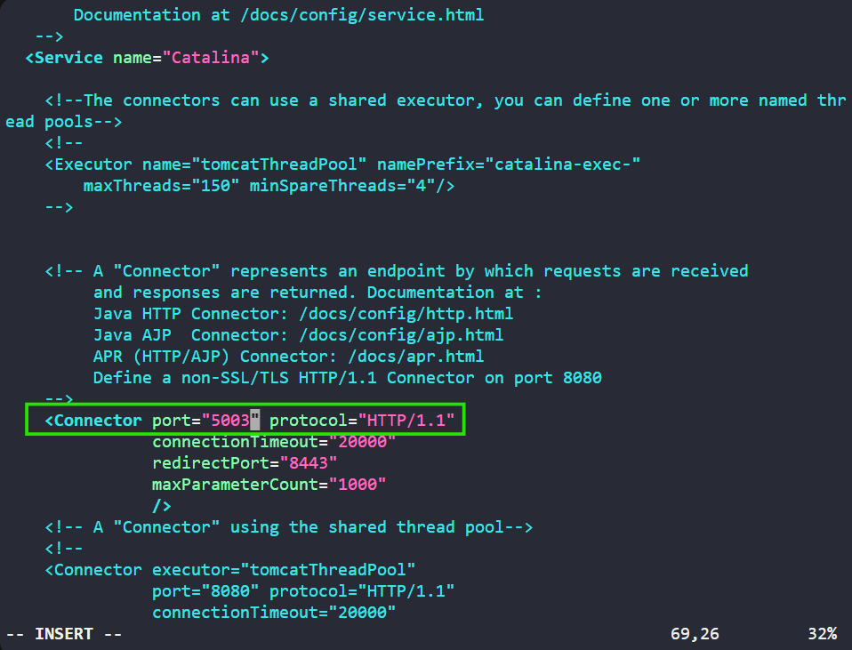

***yum install -y tomcat*** 
***systemctl start tomcat***

# TO MAKE MODIFICATIONS IN TOMCAT'S CONFIG
***vi /etc/tomcat/webserver.xml*** 
***systemctl restart tomcat***
# CHANGE TOMCAT'S PORT

# FINALLY
***Copy your .war file to tomcat's webapps locations -> /usr/share/tomcat/webapps***